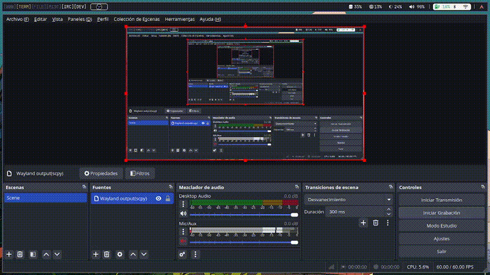

# 🌟 DEgraph: Solución Gráfica para Ecuaciones Diferenciales Ordinarias  

Las ecuaciones diferenciales son esenciales para modelar fenómenos naturales y sistemas complejos, pero muchas carecen de soluciones analíticas. **DEgraph** aborda este desafío con un entorno gráfico que facilita modelar, calcular y graficar ecuaciones diferenciales, permitiendo visualizar sistemas dinámicos mediante planos de fase y trayectorias.  

El proyecto combina cálculos numéricos avanzados con una interfaz gráfica intuitiva, desarrollada en Qt y renderizada con OpenGL, ofreciendo una experiencia fluida y atractiva. DEgraph es una herramienta útil en disciplinas como física y matemáticas para analizar comportamientos caóticos, puntos de equilibrio y fenómenos complejos como la mariposa de Lorenz.  

## 📦 Requisitos e Instalación  

### 🔧 **Dependencias**  
Para ejecutar **DEgraph**, asegúrate de tener instalados los siguientes requisitos:  

- **OpenGL** `v4.6.0`  
- **GNU Scientific Library (GSL)** `v2.8.0`  
- **Qt** `v6.8.0`  
- **muParser** `v2.3.4`  

Además, necesitarás:  
- Un compilador como `g++` o `Clang`.  
- **Qt Creator** como entorno de desarrollo.  

### 🚀 **Instalación**  
1. **Descarga el código fuente** desde el repositorio oficial: [DEgraph en GitHub](https://github.com/sammmDot/DEgraph).  
2. Abre **Qt Creator** y carga la carpeta del proyecto.  
3. **Configura el entorno** siguiendo las sugerencias de Qt Creator.  
4. Haz clic en el botón **Run** para compilar y ejecutar el programa.  

## ⚙️ Características de Uso  

1. **Interfaz gráfica intuitiva** 🎨  
   - Ingresa datos como la ecuación diferencial, subdivisión, valores mínimo y máximo.  
   - Usa los botones de ayuda para guiarte en cada campo.  

2. **Manejo de errores inteligente** 🚨  
   - Identifica y te informa de posibles errores, indicando cómo corregirlos.  

3. **Ejecución y visualización** 📈  
   - Al cumplir los requisitos matemáticos, presiona el botón **Ejecutar**.  
   - El programa calculará y graficará los puntos de la ecuación en un gráfico interactivo.  

4. **Funciones adicionales** 🔍  
   - **Glosario**: Consulta las funciones disponibles de la biblioteca `cmath`.  
   - **Representación 3D** *(en desarrollo)*: Planeamos incorporar gráficos tridimensionales.  

## 🎥 Demo  

Aunque el proyecto no está completamente terminado, hemos logrado implementar y probar gran parte de sus funcionalidades. A continuación, te presentamos una demostración de cómo funciona la interfaz gráfica y cómo logramos replicar la mariposa de Lorenz utilizando OpenGL.

  
 

---
Aunque este proyecto fue desarrollado como parte de un semestre académico y no planeamos continuarlo, esperamos que **DEgraph** pueda servir como guía o inspiración para quienes deseen crear herramientas similares. Estamos orgullosos de haber aportado este granito de arena al mundo del software libre y de haber explorado el poder de graficar ecuaciones diferenciales.  

El código es de acceso libre, y siempre estamos dispuestos a ayudar o responder consultas. Si tienes sugerencias, dudas o encuentras algún problema, no dudes en abrir un **issue** en nuestro [repositorio de GitHub](https://github.com/sammmDot/DEgraph).  

> 🌟 *Proyecto de código abierto: explorando sistemas dinámicos con estilo.*  

